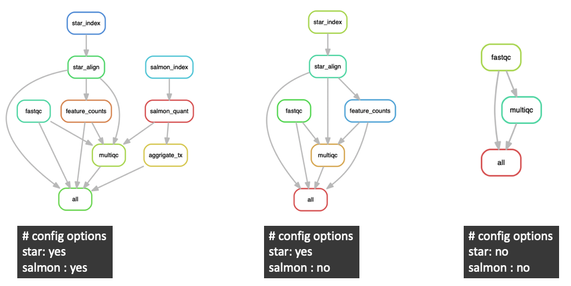

This repository contains utilities and documentation designed to serve as a starting point for setting up a High-Performance Computing (HPC) environment using [AWS ParallelCluster](https://aws.amazon.com/hpc/parallelcluster/), in conjunction with the  [Slurm](https://slurm.schedmd.com/documentation.html) workload manager. It guides users through a straightforward command-line process, detailing the creation of a customized cluster environment and a custom Amazon Machine Image (AMI), adaptable to various specific use cases. Packer streamlines the creation and configuration of custom AMIs via the command line. This approach is particularly suitable for continuous integration (CI) workflows.

The custom AMI created by the Packer templates is automatically published to the specified AWS user account. Additionally, these images are tagged to become available in the recently added [AWS ParallelCluster UI](https://docs.aws.amazon.com/parallelcluster/latest/ug/pcui-using-v3.html) upon the completion of the build.

A Dockerfile is provided to rapidly establish a reproducable build environment, equipped with all the necessary tools for custom AMI creation. This evironment includes the Packer executable and build templates, which are automatically mounted within the container. The process builds on top of official AWS ParallelCluster AMI images, leading to significantly reduced build times compared to alternate approaches. Additionally, the Dockerfile incorporates the AWS ParallelCluster CLI (v3.8), facilitating efficient command-line management of the cluster.

Additionally, the repository includes a custom [Snakemake](https://snakemake.readthedocs.io/en/stable/)-based RNA-Seq workflow, optimized for execution across a Slurm cluster. This cluster is provisioned with multiple instance types, each offering varying compute resources, ensuring both efficient processing and flexibility. To facilitate this, a compatible "cluster-config.yaml" file is provided. This file is configured to provision Slurm resources that include a `login node`, a `head node`, and multiple `compute nodes`.

#### Resources

* [AWS ParallelCluster](https://aws.amazon.com/hpc/parallelcluster/)
* [AWS ParallelCluster UI](https://docs.aws.amazon.com/parallelcluster/latest/ug/pcui-using-v3.html)
* [Slurm](https://slurm.schedmd.com/documentation.html)
* [Packer](https://www.packer.io)
* [Snakemake](https://snakemake.readthedocs.io/en/stable/)

## Docker Build and Management Environment
The build environment contains all needed tools to:
1. Build a `custom AMI` using Packer
2. Launch and manage a Slurm-based cluster utilizing Amazon's command-line tool `pcluster`
3. Connect to a cluster's `login node` login node via SSH.

First, to initiate the Docker Build and Management Environment on a `LOCAL` computer, use the provided Dockerfile with the following commands:
```
cd hpc-workflows
docker-compose up -d
```
These commands navigate you into the hpc-workflows directory and then start the Docker environment in detached mode using docker-compose.

Next, to connect to the Docker environment, use the following command:

```
docker exec -it pcluster_admin /bin/bash
```

This command will grant you interactive terminal access (`-it`) to the `pcluster_admin` container, where the necessary build tools have been pre-installed. Additionally, once inside the container, navigating to the code directory will reveal that the contents of this repository have been automatically mounted within the container for easy access.

```
root@9ace52c8d3fe:/code# ls -l
total 0
drwxr-xr-x 15 root root 480 Jan  3 18:02 hpc-workflows
```

## Custom AMI

This section details the process of building a custom AMI for use with AWS ParallelCluster, utilizing Packer and the build templates provided in this repository. By following this approach, any additional software required to support various pipelines will be built `on top of` the official AWS ParallelCluster AMI from Amazon (shown below).

#### Base Image:

Currently, `AWS ParallelCluster v3.8 Ubuntu 20.04` is used as the base image for the custom AMI.
| AMI| UID|
|---|---|
|  ami-01895f9d1f0e3f921 | aws-parallelcluster-3.8.0-ubuntu-2004-lts-hvm-x86_64-202312160956 2023-12-16T10-00-09.890Z  |

For example, the additional software specified in the build script `aws/packer/ami-rnaseq.sh` will be incorporated into `ami-01895f9d1f0e3f921`. This is necessary to support the provided RNA-Seq Snakemake workflow. To create this custom AMI, follow the steps outlined below.

**1. Define User Variables:**
Within the Docker Build Environment (`pcluster_admin`), it's important to first customize the `packer-variables.json` file. This file is crucial, as it contains key configuration variables that Packer utilizes during the build process. It specifically includes details such as the AWS user who will have access to the AMI and the AWS region in which it will be available. You can find this file at the following location within the Build Environment: `/code/hpc-workflows/aws/packer`.

It assumed that user `~/.ssh` and `~/.aws` are already configured with appropriate credentials.

```
{
    "ami_users": ["123456789012"],
    "region": "us-west-2",
    "s3_bucket": "my-bucket"
}

```
**3. Run Build:**
Execute Packer using the build.sh script. This will provision an AWS instance and build a custom AMI for use with AWS Parallel Cluster.  
```
build.sh
```

The build process takes about 20 minutes.

## Provision Cluster

There are multiple approaches available for provisioning the cluster at this point, including the use of the AWS ParallelCluster UI. However, the method outlined below facilitates the command-line creation of the cluster directly from within the Docker Build and Management Environment (`pcluster_admin`), as used in the previous steps.

Before provisioning the cluster, it is essential to first update the `cluster-config.yaml` file with the appropriate AWS resources. Within the `pcluster_admin` Docker container, this file is located at:
```
/code/hpc-workflows/parallelcluster/v3/cluster-config.yaml
```

The values that must be updated are:

|  Value |  Field | Description|
|---|---|---|
| CustomAmi  | `<ami-id>`  |  AMI created in build steps above |
| SubnetId  | `<subnet-id>` | ParallelCluster subnet ID (see below)  |
| KeyName  | `<ssh-key-name>` |  AWS ssh key (.pem) file |
| AllowedIps  |  `<cidr-block>` | IP block allowed to connect to cluster |
| PlacementGroupName  | `<placement-group-name>` |  Placement group where resources will be created |


### ParallelClusterVPC

To launch a cluster, a Virtual Private Cloud (VPC) is required. This can be generated from the command line using the pcluster configure command within the `pcluster_admin` container:

```
pcluster configure --config tmp-config-file.yaml
```

Executing this command initiates a guided process to configure the VPC appropriately for your specific use case. It also generates the associated Subnet IDs, which are listed in the `tmp-config-file.yaml`. These IDs can then be manually added to the `cluster-config.yaml` file. Creating both public and private Subnets during this configuration process allows for greater flexibility when applying settings in the `cluster-config.yaml`.

#### Additional Resources

1. [Network Configuration](https://docs.aws.amazon.com/parallelcluster/latest/ug/network-configuration-v3.html): Options and considerations for network setup.
2. [PlacementGroups](https://docs.aws.amazon.com/AWSEC2/latest/UserGuide/placement-groups.html): Considerations regarding their impact on overall cluster performance.

### Launch Cluster

From within the `pcluster_admin` container:

```
pcluster create-cluster -n <cluster-name> -c cluster-config.yaml 
```

The default configuration creates the following resources.

##### Compute Resources:

| Node  | Slurm Queue | Initial | Max | Instance Type |  vCPU  | Mem (GB)) | Subnet* |
|---|---|---|---|---|---|---|---|
| Login Node | - | 1 | 1  | t3.nano | 2 | 0.5 | public |
| Head Node  | -  | 1 | 1 |  m5a.large |  2 | 8 | private |
| Compute  | all | 0  | 2 |  r5a.2xlarge | 8| 64| private |
| Compute  | compute1 | 1  | 4|  c5a.8xlarge | 32 | 64 | private |
| Compute  | compute2 | 0 | 2 |  c5a.8xlarge | 32 | 64 | private |
| Compute  | highmem | 0  | 4 |  r5a.4xlarge | 16 |  128 | private |

*The subnet configurations shown, including public and private subnets, are as tested and can be tailored per use case as described above.

##### NFS Storage:

Shared storage, configured as NFS, is automatically mounted at `/nfs`, utilizing `st1` Hard Disk Drive (HDD) volumes, supporting a throughput of up to 500 MiB/s and 500 IOPS. The default NFS size is 12TB, which is provides the maximum I/O throughput for `st1`.

#### Additional Resources

1. [EBS Storage](https://docs.aws.amazon.com/AWSEC2/latest/UserGuide/ebs-volume-types.html)


### Head Node Login

Once a the cluter is provisioned, pcluster can be used to login to the head node.  

```
pcluster ssh -i <pem-file> -n <cluster-name>
```

#### Additional Resources

1. [AWS ParallelCluster CLI commands](https://docs.aws.amazon.com/parallelcluster/latest/ug/pcluster-v3.html)


## RNA-Seq Workflow

The provided RNA-Seq workflow is located at: `hpc-workflows/src/rnaseq/rnaseq.smk`.

### Analysis Configuration

First, clone and install this repo into the `login node`. Once installed, the script `create-config.py` can be used to create the `config.yaml` file required by the Snakemake.

```
create_config.py -f seq/*.gz -o analysis
```

This creates a template `config.yml` file that must be configured with the preferred optional workflow steps. For example, indicate `yes|no` to include or exclude `Salmon` quantification. Paths to supporting resources, including reference genomes, annotation files, and TruSeq adapters must also be configured and are not bundled with this repository.

**Example config.yml:**
```yml
analysis_name: rnaseq_analysis
star: yes
salmon: yes
trim: yes
resources_dir: /nfs/resources
build: hg38
genome_uid: hg38wERCC92
tx_uid: ensembl_rel83
annotation_gtf: gencode.v25.primary_assembly.annotation.wERCC92.gtf
tx2gene_fp: /nfs/resources/transcriptomes/hg38/ensembl_rel86/annotation/tx2gene/tx2gene.EnsDb.Hsapiens.v86.csv
star_sj_db_overhang: 149
out: /nfs/workspace/out/run001/analysis
options:
  trimmomatic-adapters-fa: TruSeq3-PE-2.fa
samples:
  S001:
    read1: /nfs/workspace/run001/S001_R1.fastq.gz
    read2: /nfs/workspace/run001/S001_R2.fastq.gz
  S002:
    read1: /nfs/workspace/run001/S002_R1.fastq.gz
    read2: /nfs/workspace/run001/S002_R2.fastq.gz
```

### Workflow Options

The below figure shows optional configuration settings and associated workflow steps:




## Run the workflow

Prior to running the workflow, your analysis directory structure should be roughly as follows:

```bash
.
├── config.yml
├── rnaseq.smk
├── seq
│   ├── S001_R1.fastq.gz
│   ├── . . .
│   └── S002_R2.fastq.gz
└── slurm
    └── config.yaml
```

To run the workflow:
```
nohup snakemake --keep-going -s rnaseq.smk --profile slurm &> out.log &
```


## History

I developed the code in this repository while working at [PreCyte, Inc.](https://www.precyte.net/) to support our internal research and development efforts. It will continue to be actively maintained and updated here. Recent updates include an upgrade to ParallelCluster (v3.8), released in December 2023, a limited integration with the recently released AWS ParallelCluster UI, and the addition of a login node pool to enhance the cluster configuration.